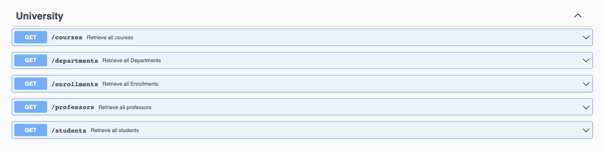
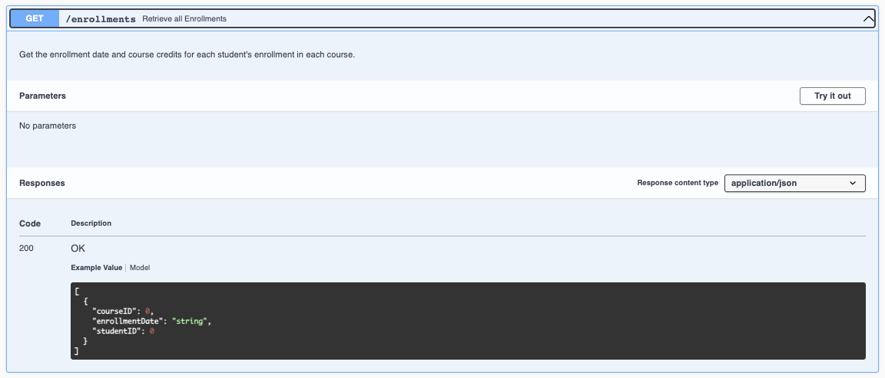
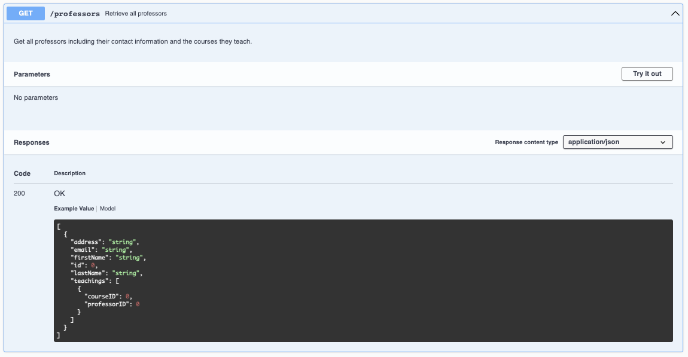

# Graded Challenge 2 - P2
Graded Challenge ini dibuat guna mengevaluasi pembelajaran pada Hacktiv8 Program Fulltime Golang khususnya pada pembelajaran Database - PostgreSQL 

## Assignment Objectives
Graded Challenge 2 ini dibuat guna mengevaluasi pemahaman SQL sebagai berikut:

- Mampu memahami konsep database PostgreSQL
- Mampu melakukan implementasi ERD
- Mampu memahami query sql yang diminta
- Mampu implementasi pembuatan REST API dengan Echo Framework
- Mampu implemantasi JWT pada REST API dengan Echo Framework

## Assignment Directions - University Academic Program API
Universitas perlu mengelola data mahasiswa, mata kuliah, dan dosen untuk program akademik mereka. Mahasiswa dapat mendaftar di beberapa mata kuliah, dan mata kuliah dapat memiliki beberapa mahasiswa yang terdaftar. Dosen dapat mengajar beberapa mata kuliah, dan satu mata kuliah dapat diajar oleh beberapa dosen. Setiap mahasiswa dan dosen memiliki informasi kontak dasar yang disimpan dalam basis data. Universitas juga perlu melacak tanggal pendaftaran dan kredit mata kuliah untuk setiap pendaftaran mahasiswa di setiap mata kuliah. Selain itu, mata kuliah dikelompokkan ke dalam departemen, yang diidentifikasi dengan ID departemen.

### Requirements:
- Database Requirement
  - Database harus memiliki beberapa table untuk dapat menyimpan data berikut
    1. students table:
      - student_id: A unique identifier for each student.
      - first_name: The first name of the student.
      - last_name: The last name of the student.
      - email: The email address of the student. This field must be unique.
      - address: The address of the student.
      - date_of_birth: The date of birth of the student.

    2. courses table:
      - course_id: A unique identifier for each course.
      - name: The name of the course.
      - description: A description of the course.
      - department_id: A foreign key referencing the departments table, indicating the department that the course belongs to.
      - credits: The number of credits associated with the course.

    3. professors table:
      - professor_id: A unique identifier for each professor.
      - first_name: The first name of the professor.
      - last_name: The last name of the professor.
      - email: The email address of the professor. This field must be unique.
      - address: The address of the professor.

    4. enrollments table:
      - student_id: A foreign key referencing the students table, indicating the student who is enrolled in the course.
      - course_id: A foreign key referencing the courses table, indicating the course that the student is enrolled in.
      - enrollment_date: The date on which the student enrolled in the course. This field is required.

    5. departments table:
      - department_id: A unique identifier for each department.
      - name: The name of the department.
      - description: A description of the department.

    6. teachings table:
      - professor_id: A foreign key referencing the professors table, indicating the professor who is teaching the course.
      - course_id: A foreign key referencing the courses table, indicating the course that the professor is teaching.
  - RESTRICTION
    - Pastikan email setiap student dan professor harus unik dan tidak boleh ada yang sama.
    - Pastikan semua field pada database tidak boleh kosong/null
  - Buatlah skema ERD berdasarkan requirement diatas, pastikan database sudah ternormalisasi minimal sampai 3NF.
  - Pastikan untuk menyertakan query DDL dan Query seeding data pada folder project GC ini, buatlah file dengan nama ddl.sql pada root folder. (jika ada)

- Query Requirement
  - Buatlah query pada file query.sql untuk mengambil data berikut:
  
    a. Daftar semua student, termasuk informasi kontak mereka dan mata kuliah yang saat ini mereka ikuti.
    
    b. Daftar semua mata kuliah, termasuk departemen tempat mereka berada, dosen yang mengajarkannya, dan student yang saat ini terdaftar di dalamnya.
    
    c. Daftar semua dosen, termasuk informasi kontak mereka dan mata kuliah yang mereka ajarkan.
    
    d. Tanggal pendaftaran dan kredit mata kuliah untuk setiap pendaftaran student di setiap mata kuliah.
    
    e. Daftar semua departemen dan mata kuliah yang termasuk ke dalam setiap departemen.
    
    f. Jumlah total student yang terdaftar di setiap mata kuliah.
    
    g. Rata-rata jumlah student yang terdaftar dalam mata kuliah di setiap departemen.

- Web API untuk user harus memiliki beberapa fitur sebagai berikut:
  - <b>POST</b> /students/register - Menyimpan data student baru
    - Request dari endpoint ini harus meliputi nama, alamat, email, password, dan tanggal lahir
    - Response dari endpoint ini harus berupa message sukses, dan data student yang berhasil disimpan, jika terdapat kesalahan pada request maka response harus terdiri dari message yang menjelaskan kesalahan pada input request nya.
    - Perlu diperhatikan, untuk tidak mengikutsertakan data sensitif seperti password pada response
  - <b>POST</b> /students/login - Login untuk mendapatkan akses token
    - Request dari endpoint ini harus meliputi email, password
    - Response dari endpoint ini adalah akses token JWT, jika terdapat kesalahan pada request maka response harus terdiri dari message yang menjelaskan kesalahan pada input request nya.
  - Memerlukan login/autentikasi menggunakan JWT, pastikan untuk mengakses setiap endpoint dibawah, perlu disertakan akses token pada headers dengan key `authorization`, jika akses token jwt tidak terautentikasi, maka web api perlu memberikan response error tidak terautentikasi beserta message yang sesuai.
    - <b>GET</b> /students/me - Mendapatkan informasi mengenai user yang sedang login (yang token nya dicantumkan pada request headers)
      - Response merupakan data detail user, meliputi nama lengkap, alamat, tanggal lahir, beserta course yang sudah di-enroll oleh student, data enrollment  harus mencakup judul course yang di-enroll dan tanggal enrollment.
    - <b>GET</b> /courses - Mendapatkan informasi courses yang tersedia
      - Response merupakan array of object dari data course.
    - <b>POST</b> /enrollments - Melakukan enroll terhadap suatu course
      - Request dari endpoint ini harus meliputi data id course yang ingin di-enroll, pastikan student tidak dapat enroll ke course yang sama lebih dari satu kali.
      - Response dari endpoint ini adalah data enrollment yang berhasil dibuat, meliputi data course yang dipilih, dam tanggal enrollment. Jika terdapat kesalahan pada request maka response harus terdiri dari message yang menjelaskan kesalahan pada input request nya.
    - <b>DELETE</b> /enrollments/:id - Menghapus data enrollment
      - Request dari endpoint ini harus meliputi data id enrollment yang ingin dihapus
      - Response dari endpoint ini adalah data enrollment yang berhasil dihapus, meliputi data course yang dipilih, dam tanggal enrollment. Jika terdapat kesalahan pada request maka response harus terdiri dari message yang menjelaskan kesalahan pada input request nya.
  - Setiap endpoint diatas harus menerapkan best practice REST termasuk status code dan http method yang digunakan
  - Khusus untuk API untuk student, perlu dibuat dokumentasi API menggunakan `Swagger` dan dapat diakses pada `/swagger/index.html`
- Deployment Requirement
  - Buatlah database pada platform Supabase(postgreSQL) dan sambungkan dengan aplikasi anda.
  - Deploy REST API yang sudah anda buat dengan menggunakan platform Heroku, dan pastikan mencantumkan url hasil deployment pada section expected result dan deployment notes.

## Expected Result
- Web API dapat diakses pada _________ (isi dengan url hasil deployment anda).
- Web API memiliki endpoint sebagai berikut
  - <b>POST</b> /students/register
    - request body -> `{ first_name, last_name, address, email, password, date_of_birth }`
  - <b>POST</b> /students/login 
    - request body -> `{ email, password }`
  - <b>GET</b> /students/me
    - request headers -> `{ authorization }`
  - <b>GET</b> /courses
    - request headers -> `{ authorization }`
  - <b>POST</b> /enrollments
    - request headers -> `{ authorization }`
    - request body -> `{ course_id }`
  - <b>POST</b> /enrollments/:enrollment_id
    - request headers -> `{ authorization }`
- Berikut adalah contoh screenshot dari dokumentasi yang harus anda buat, sesuaikan api docs yang anda buat dengan endpoint, request, dan resopnse yang anda buat. Pastikan api documentation dapat diakses pada `/swagger/index.html`

## Assignment Submission
Push Assigment yang telah Anda buat ke akun Github Classroom Anda masing-masing.

### Assignment Notes:
- Jangan terburu-buru dalam menyelesaikan masalah atau mencoba untuk menyelesaikannya sekaligus.
- Jangan menyalin kode dari sumber eksternal tanpa memahami bagaimana kode tersebut bekerja.
- Jangan menentukan nilai secara hardcode atau mengandalkan asumsi yang mungkin tidak berlaku dalam semua kasus.
- Jangan lupa untuk menangani negative case, seperti input yang tidak valid
- Jangan ragu untuk melakukan refaktor kode Anda, buatlah struktur project anda lebih mudah dibaca dan dikembangkan kedepannya, pisahkanlah setiap bagian kode program pada folder sesuai dengan tugasnya masing-masing.
- Jangan lupa untuk mendokumentasikan endpoint yang dibuat dengan format OpenAPI dengan menggunakan `swaggo`.

### Additional Notes
Total Points : 100

Deadline : Diinformasikan oleh instruktur saat briefing GC. Keterlambatan pengumpulan tugas mengakibatkan skor GC 2 menjadi 0.

Informasi yang tidak dicantumkan pada file ini harap dipastikan/ditanyakan kembali kepada instruktur. Kesalahan asumsi dari peserta mungkin akan menyebabkan kesalahan pemahaman requirement dan mengakibatkan pengurangan nilai.

### Deployment Notes
Deployed url: _________ (isi dengan url hasil deployment anda)
